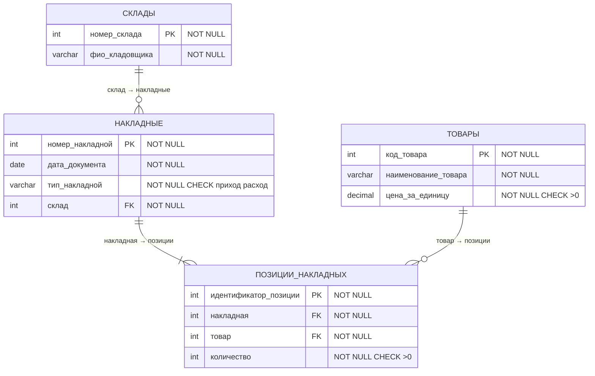

# labsforBASE
Лабораторные работы по Базам Данных  
Анциферов Никита 02261-ДБ  
Вариант 7. Учет наличия товара на складе
## ER-диаграмма

## Логическая модель по диаграмме
**Сущность "Склады"**

Ключевой атрибут: номер_склада (уникальный идентификатор)

Описательные атрибуты: фио_кладовщика (строка, обязательный)

**Сущность "Товары"**

Ключевой атрибут: код_товара (уникальный идентификатор)

Описательные атрибуты: наименование_товара (строка, обязательный), цена_за_единицу (число, обязательный)

**Сущность "Накладные"**

Ключевой атрибут: номер_накладной (уникальный идентификатор)

Описательные атрибуты:

дата_документа (дата, обязательный)

тип_накладной (перечисление: "приход", "расход", обязательный)

Атрибуты-связи: склад (внешний ключ к сущности "Склады", обязательный)

**Сущность "Позиции_накладных"**

Ключевой атрибут: идентификатор_позиции (уникальный идентификатор)

Описательные атрибуты: количество (целое число, обязательный, больше 0)

##Физическая модель

