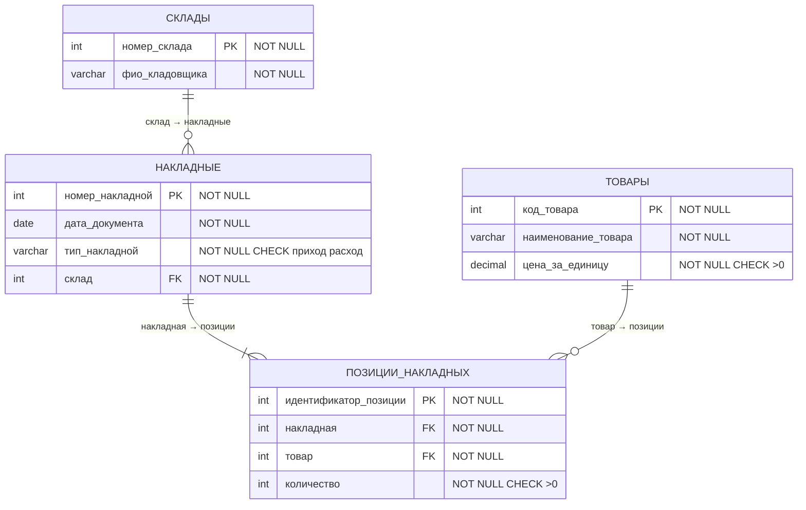

# labsforBASE
Лабораторные работы по Базам Данных  
Анциферов Никита 02261-ДБ  
Вариант 7. Учет наличия товара на складе
## ER-диаграмма

## Логическая модель по диаграмме
**Сущность "Склады"**

Ключевой атрибут: номер_склада (уникальный идентификатор)

Описательные атрибуты: фио_кладовщика (строка, обязательный)

**Сущность "Товары"**

Ключевой атрибут: код_товара (уникальный идентификатор)

Описательные атрибуты: наименование_товара (строка, обязательный), цена_за_единицу (число, обязательный)

**Сущность "Накладные"**

Ключевой атрибут: номер_накладной (уникальный идентификатор)

Описательные атрибуты:

дата_документа (дата, обязательный)

тип_накладной (перечисление: "приход", "расход", обязательный)

Атрибуты-связи: склад (внешний ключ к сущности "Склады", обязательный)

**Сущность "Позиции_накладных"**

Ключевой атрибут: идентификатор_позиции (уникальный идентификатор)

Описательные атрибуты: количество (целое число, обязательный, больше 0)

## Физическая модель

 **Описание физической модели:**
1. Таблицы и их назначение:
СКЛАДЫ - хранит информацию о складах

ТОВАРЫ - справочник товаров с ценами

НАКЛАДНЫЕ - документы прихода/расхода товаров

ПОЗИЦИИ_НАКЛАДНЫХ - детализация накладных по товарам

2. Типы данных:
INTEGER - для идентификаторов

VARCHAR(n) - для текстовых полей

DECIMAL - для цен

DATE - для дат

3. Ограничения целостности:
PRIMARY KEY - первичные ключи

FOREIGN KEY - внешние ключи

NOT NULL - обязательные поля

CHECK - проверочные ограничения
## 2 лабораторная

**Запросы с JOIN**

1 документ

2 документ

